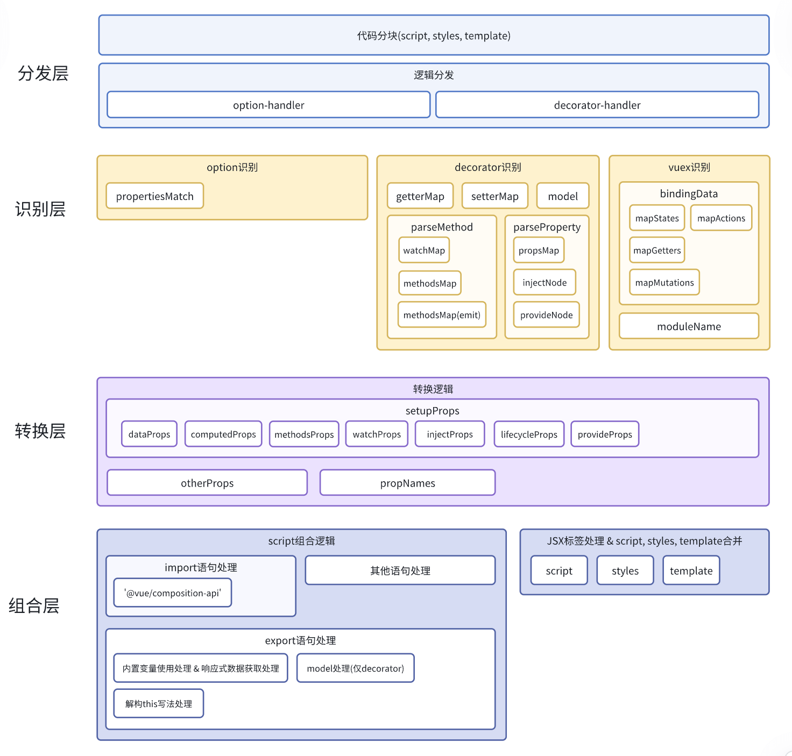

# vue-code-converter

## 一、介绍

vue 代码转换工具，目前支持两种格式转换：

- option-style -> composition-api-style
- decorator-style -> composition-api-style

## 二、特性说明

- **option-style**
  - data -> ref()
  - computed -> computed()
  - watch -> watch()
  - methods -> function
  - props -> toRefs()
  - inject -> inject()
  - provide -> provide()
- **decorator-style**
  - get, set -> computed
  - @Watch, @Emit, @Model, @Inject, @Model, @Provide
- **vuex**
  - mapState, mapGetters -> computed()
  - mapActions, mapMutations -> function
  - createNamespacedHelpers
- **lifecycle**
  - beforeCreate, created -> Immediate function
  - beforeUnmount, beforeDestroy -> onBeforeUnmount
  - destroyed -> onUnmounted
  - xxx -> onXxx
- **this**
  - xx -> xx.value
  - $attrs, $slots, $parent, $root, $listeners, $refs, $emit -> ctx.$xx
  - $xx -> ctx.root.$xx
  - { xx } = this -> xx = xx.value

## 二、整体架构

转换能力主要依赖 typescript 的 ast 能力实现。整体架构如下： 

## 三、使用方式

### 2.1 在线转换

> 转化平台在线代码转换：https://stardew.site/briar/tools/composition-style-converter

### 2.2 脚本转换

```shell
# 全局安装 `@briar/vue-code-converter`
npm add @briar/vue-code-converter -g

# 获取 cli 选项帮助说明
vue-convert -h

# 对指定目录或文件进行代码转化（默认为当前目录）
vue-convert -p ./client/pages/center

```

### 2.3 方法调用

安装 `@briar/vue-code-converter`：

```shell
npm add @briar/vue-code-converter
```

在代码中直接调用转换方法：

```javascript
import { convert } from '@briar/vue-code-converter';

const { output, warning } = convert(input, {
	// 设置为 true 开启非法语法告警
	strict: true,
	// 设置输出结果的 prettier 格式化参数，类型与 prettier.format 的 option 类型一致（https://www.prettier.cn/docs/options.html）
	// 以下为默认值
	prettier: {
		parser: 'vue',
		plugins: [parserHtml],
		singleQuote: true,
		semi: true,
		printWidth: 80,
		tabWidth: 2,
		useTabs: false,
		trailingComma: 'none',
		bracketSpacing: true,
		vueIndentScriptAndStyle: false
	}
});
```

## 四、需要手动处理的场景

### 4.1 extends & mixins

composition-api 建议使用 hook 代替 mixin & extends，使用者需要自己去实现 hook 替代 mixin & extends。

### 4.2 vuex-module-decorators & vuex-class

composition-api 不支持和 vuex-module-decorators & vuex-class 混用，使用者需要自己去实现重写 vuex 替代 vuex-module-decorators & vuex-class。
